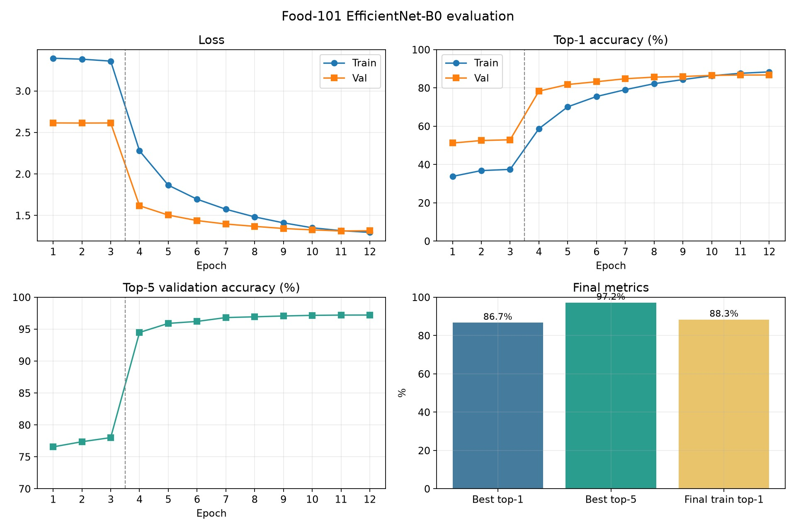
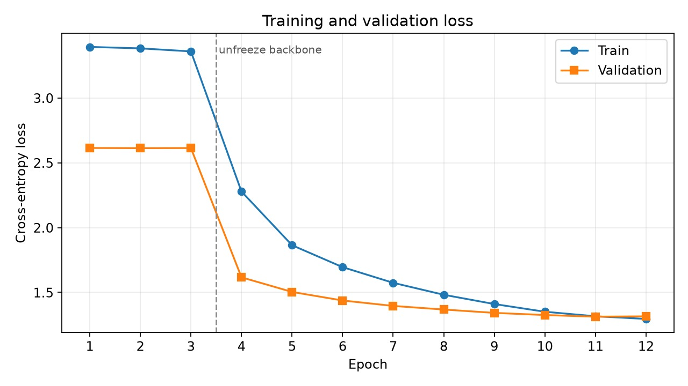
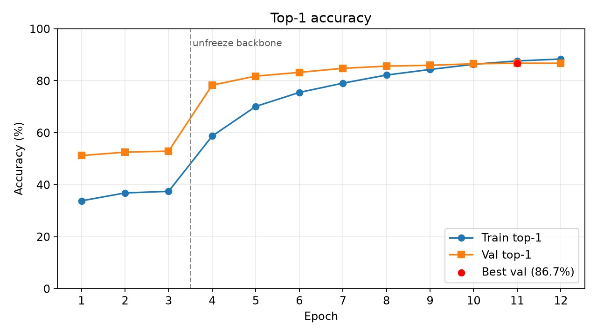
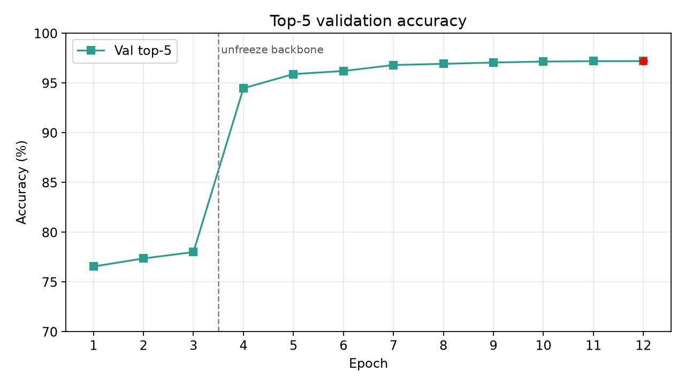
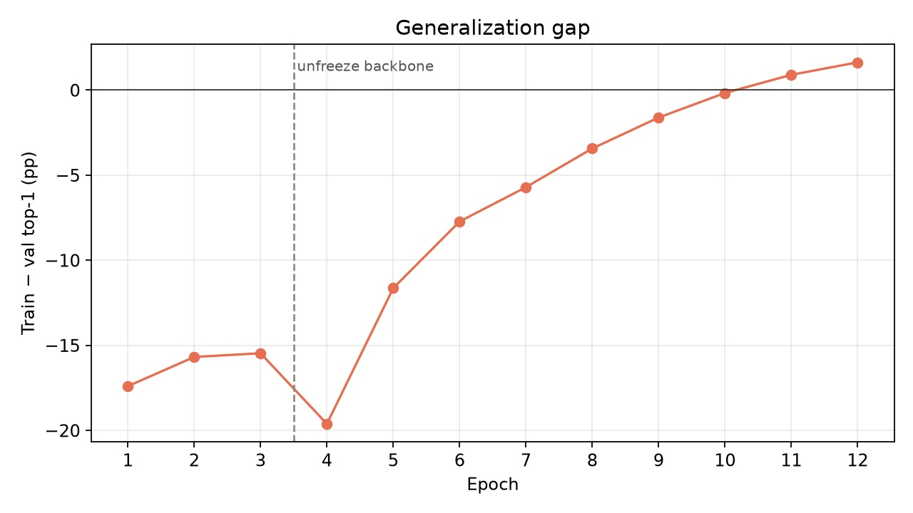

# Food Recognition and Calorie Estimation

Recognize dishes from photos (Food-101, 101 classes) and estimate calories plus protein, fat, and carbs from typical USDA-style values. Built for Prodigy InfoTech ML intern task 05.

## What it does

1. Classifies an image with a fine-tuned **EfficientNet-B0** model.
2. Maps the predicted dish to **calories and macros per 100 g**.
3. Scales those values to a **typical serving**, which you can change in grams.
4. Lets you **log meals** in a Streamlit tracker.

Food-101 has labels only — no calorie targets. Calorie output is a lookup after classification, not a pixel-to-kcal regressor. That is the usual, honest design for this dataset.

Dataset: [Food-101 on Kaggle](https://www.kaggle.com/dansbecker/food-101) (same data as ETH Zurich Food-101: 101,000 images, 750 train / 250 test per class).

## Setup

Python 3.10+ with PyTorch (CUDA recommended).

```bash
pip install -r requirements.txt
```

## Train

Place the Kaggle Food-101 extract at `data/food-101/food-101/` (with `images/` and `meta/`). Then fine-tune EfficientNet-B0:

- 3 epochs with a frozen backbone (train the classifier head)
- remaining epochs with the backbone unfrozen at a lower learning rate
- mixed precision, label smoothing, and the official train/test split

```bash
python -m src.train
```

Useful flags:

```bash
python -m src.train --epochs 12 --freeze-epochs 3 --batch-size 16
```

On a 4 GB GPU, keep `--batch-size` at 16 (or 8 if you hit out-of-memory). Best weights go to `checkpoints/best_model.pt`.

Regenerate plots from `checkpoints/history.json`:

```bash
python -m src.plot_metrics
```

## Evaluation results

12 epochs on Food-101 (official split: 75,750 train / 25,250 test). Epochs 1–3 train the classifier head only; from epoch 4 the EfficientNet-B0 backbone is unfrozen.

| Metric | Value |
|--------|--------|
| Best val top-1 | **86.71%** (epoch 11) |
| Best val top-5 | **97.20%** (epoch 12) |
| Final train top-1 | 88.33% |
| Final val loss | 1.315 |

| Epoch | Train loss | Train top-1 | Val loss | Val top-1 | Val top-5 |
|------:|-----------:|------------:|---------:|----------:|----------:|
| 1 | 3.394 | 33.8% | 2.614 | 51.2% | 76.6% |
| 2 | 3.382 | 36.8% | 2.613 | 52.5% | 77.4% |
| 3 | 3.359 | 37.4% | 2.614 | 52.9% | 78.0% |
| 4 | 2.278 | 58.7% | 1.617 | 78.3% | 94.5% |
| 5 | 1.864 | 70.1% | 1.504 | 81.7% | 95.9% |
| 6 | 1.695 | 75.5% | 1.438 | 83.2% | 96.2% |
| 7 | 1.574 | 79.0% | 1.396 | 84.8% | 96.8% |
| 8 | 1.482 | 82.2% | 1.368 | 85.6% | 96.9% |
| 9 | 1.410 | 84.3% | 1.342 | 85.9% | 97.1% |
| 10 | 1.351 | 86.3% | 1.326 | 86.5% | 97.2% |
| 11 | 1.316 | 87.6% | 1.313 | **86.71%** | 97.2% |
| 12 | 1.296 | 88.3% | 1.315 | 86.70% | **97.20%** |

### Overview



### Loss



### Top-1 accuracy



### Top-5 accuracy



### Generalization gap

Train top-1 minus val top-1 (percentage points). A growing positive gap means the model is fitting the training set faster than it generalizes.



## Evaluate and predict

```bash
python -m src.evaluate
python -m src.predict path/to/food.jpg --grams 200
```

## App

```bash
streamlit run app.py
```

Upload or capture a photo, confirm the top prediction, set portion size, and add the meal to a daily log.

## Project layout

| Path | Role |
|------|------|
| `src/train.py` | Training loop |
| `src/model.py` | EfficientNet-B0 classifier |
| `src/dataset.py` | Food-101 loaders and transforms |
| `src/predict.py` | CLI inference |
| `src/plot_metrics.py` | Evaluation graphs from `history.json` |
| `src/nutrition.py` | Serving-size scaling |
| `docs/` | Loss, accuracy, and gap plots |
| `data/nutrition.json` | Per-class calories and macros |
| `app.py` | Streamlit tracker |

## Notes

- Nutrition figures are typical averages. Restaurant recipes, oil, and sides vary.
- Images do not encode true plate weight; always adjust grams.
- This run reached **86.7%** val top-1 and **97.2%** val top-5 after 12 epochs on a GTX 1650.
